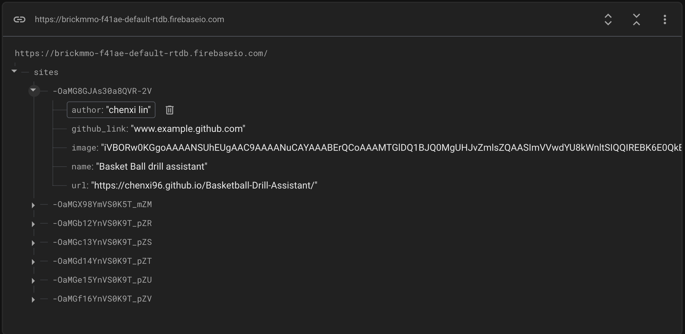

# Quirky Directory V3

A web directory storing quirky websites created by [https://mediaarts.humber.ca/programs/web-development.html](Web Development) students at [Humber Polytechnic](https://humber.ca/). 

> Live website is avaialable at:
> [https://quirky.codeadam.ca](https://quirky.codeadam.ca)

## Database Design

---

## Project Stack

This project uses basic HTML, JavaScript, and [https://firebase.google.com/](Firebase).

This repo is hosted using [GitHub Pages](https://pages.github.com/).

  

---

## Repo Resources

- [Quirky Web](https://quirky.codeadam.ca/)
- [Firebase](https://firebase.google.com/)
- [The Useless Web](https://theuselessweb.com/)

 

